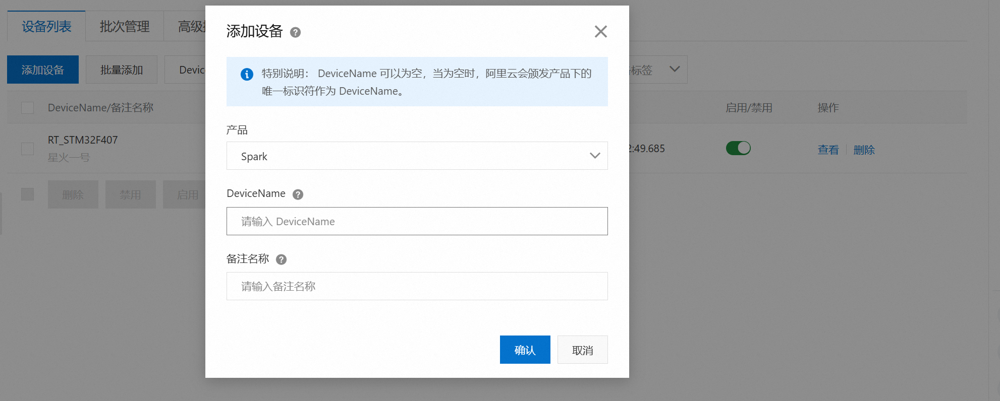
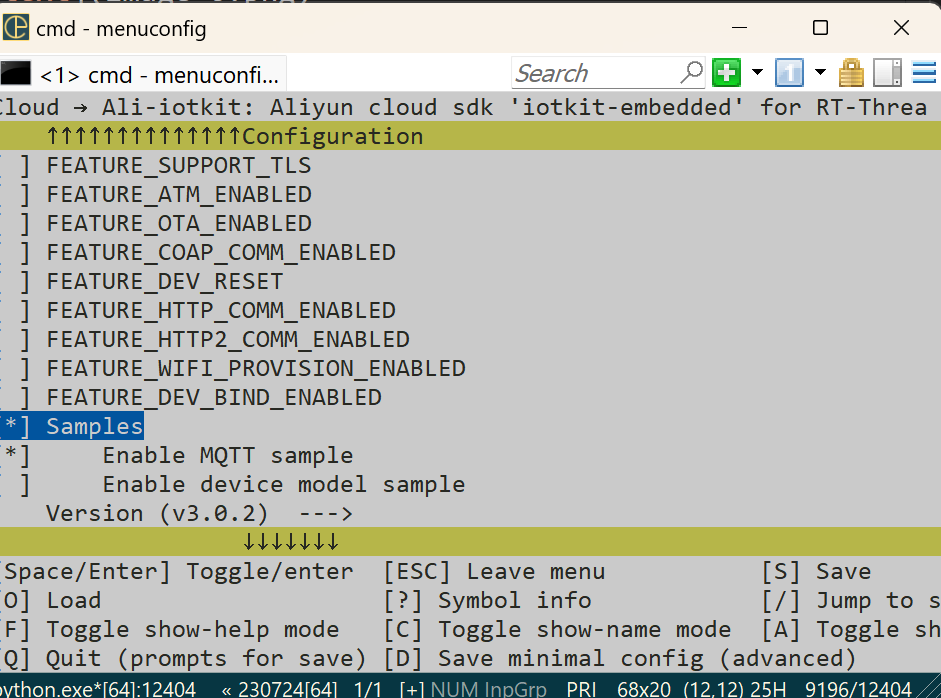

# 夏令营进度汇总
## 项目介绍：
预计实现利用板载AHT10搭配RW007连接WiFi通过MQTT在阿里云平台显示相应的温度湿度。
## 搭建前期环境：
### AHT20环境搭建
1、使用env工具，在tm32f407-rt-spark目录下使用env，输入命令：menuconfig进入菜单栏：

2、在以下路径下打开板载对应的温湿度软件包，查看手册发现虽然板子自带的是AHT20，经过测试后发现驱动是适配的了，温湿度传感器代码、i2c地址也是正确的：

3、如果有精度需求，需要输出小数，还需要添加rt_vsnprintf_full包：

最后在退出menuconfig,选择Y保存当前选择,在env界面输入"pkgs --update"更新配置完成即可。
### 阿里云环境搭建
1、在阿里云物联网平台注册一个账号，在产品一栏找到物联网平台

2、点击管理控制台：

3、进入公共实例，没有开通可以先去个人资料开通：

4、点击设备管理，找到产品，新建一个产品，名字自己取一个自己喜欢的就可以了：

5、创建完产品后，再找到设备，选择刚刚创建的产品下添加一个设备，名字和备注按照自己需求填写：

6、在产品的功能定义中可以添加自己的功能模块，我这里只用到了温度和湿度，所以就用默认的就可以了，有需求可以自己添加：

### 阿里云软件包的下载
使用env工具，在tm32f407-rt-spark目录下使用env，输入命令：menuconfig进入菜单栏：
1、打开RW007，wifi模块的软件包,按图配置下针脚：

2、这里设置下前四个选项：分别是产品key和密钥，设备名和密钥。这些在阿里云创建的产品和设备那里可以查看：

顺便打开下面的simple，我们使用这个sample来修改，实现我们的功能：

最后在退出menuconfig,选择Y保存当前选择,在env界面输入"pkgs --update"更新配置完成即可。
## 代码编写与功能实现
### 代码
1、我们通过mqtt-example.c实例进行修改，在开头添加上我们缺少的头文件，还有AHT的全局变量定义，指针等等...

2、在mqtt_example_main中添加进我们的初始温湿度代码

3、根据下图填补修改，实现将采集到的温湿度数据上传到阿里云平台

### 功能实现
1、在终端输入scons -j16编译，F5下载，打开串口工具，连接WiFi：

2、打开对应线程：

### 现象
1、可以在串口看到当前采集并发送出去的数据：

2、打开阿里云平台：在设备的物理模型中可以看到数据已经收到并且跟随环境在改变：

## 未来计划与实现
    学的有点慢，自己还有很多不足，在后续如果时间充足，会将板载中的其他传感器的功能进行开发，并将其上传至阿里云平台，同时利用板载LCD进行显示。
